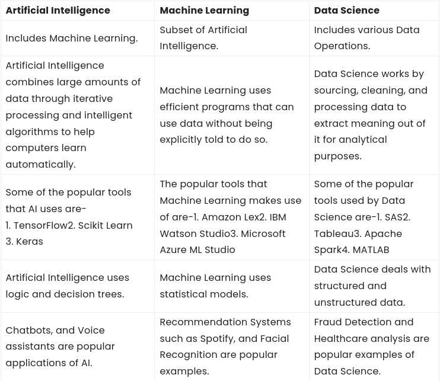

# Machine Learning

## Unit I: Intro to Machine Learning

### Introduction to Machine Learning

**Definition of Machine Learning:** Arthur Samuel, an early American leader in the field of computer gaming and artificial intelligence, coined the term “Machine Learning ” in 1959 while at IBM. He defined machine learning as “the field of study that gives computers the ability to learn without being explicitly programmed “. However, there is no universally accepted definition for machine learning. Different authors define the term differently. We give below two more definitions.

*   Machine learning is programming computers to optimize a performance criterion using example data or past experience . We have a model defined up to some parameters, and learning is the execution of a computer program to optimize the parameters of the model using the training data or past experience. The model may be predictive to make predictions in the future, or descriptive to gain knowledge from data.

*   The field of study known as machine learning is concerned with the question of how to construct computer programs that automatically improve with experience.

### Comparison of Machine learning with traditional programming

Traditional computer programming has been around for more than a century, with the first known computer program dating back to the mid 1800s. Traditional Programming refers to any manually created program that uses input data and runs on a computer to produce the output.

But for decades now, an advanced type of programming has revolutionized business, particularly in the areas of intelligence and embedded analytics. In Machine Learning programming, also known as augmented analytics, the input data and output are fed to an algorithm to create a program. This yields powerful insights that can be used to predict future outcomes.

**Traditional Programming**

Traditional programming is a manual process—meaning a person (programmer) creates the program. But without anyone programming the logic, one has to manually formulate or code rules.

*   `Input + Program = Output`

In machine learning, on the other hand, the algorithm automatically formulates the rules from the data.

**Machine Learning Programming**

Unlike traditional programming, machine learning is an automated process. It can increase the value of your embedded analytics in many areas, including data prep, natural language interfaces, automatic outlier detection, recommendations, and causality and significance detection. All of these features help speed user insights and reduce decision bias.

*   `Input + Output = Program `

For example, if you feed in customer demographics and transactions as input data and use historical customer churn rates as your output data, the algorithm will formulate a program that can predict if a customer will churn or not. That program is called a predictive model.

*   `Input[demographics + transactions] + Output[churned or not] = Program[churn model]`

You can use this model to predict business outcomes in any situation where you have input and historical output data:

1.  Identify the business question you would like to ask.
2.  Identify the historical input.
3.  Identify the historically observed output (i.e., data samples for when the condition is true and for when it’s false).

For instance, if you want to predict who will pay the bills late, identify the input (customer demographics, bills) and the output (pay late or not), and let the machine learning use this data to create your model.

*   `Input + Output = Program `

As you can see, machine learning can turn your business data into a financial asset. You can point the algorithm at your data so it can learn powerful rules that can be used to predict future outcomes. It’s no wonder predictive analytics is now the number one capability on product roadmaps.

### ML vs AI vs Data Science

*   Data science is the field of study that combines domain expertise, programming skills, and knowledge of mathematics and statistics to extract meaningful insights from data.

*   Artificial intelligence is the simulation of human intelligence processes by machines, especially computer systems. Specific applications of AI include expert systems, natural language processing, speech recognition and machine vision.

*   [Machine Learning Definition](#introduction-to-machine-learning)

[READ MORE](https://www.mygreatlearning.com/blog/difference-data-science-machine-learning-ai/)

### Types of learning

**Definition of learning:** A computer program is said to learn from experience E with respect to some class of tasks T and performance measure P , if its performance at tasks T, as measured by P , improves with experience E.

*   **Examples**

*   Handwriting recognition learning problem
    *   Task T :  Recognizing and classifying handwritten words within images
    *   Performance P : Percent of words correctly classified
    *   Training experience E : A dataset of handwritten words with given classifications

*   A robot driving learning problem
    *   Task T : Driving on highways using vision sensors
    *   Performance P : Average distance traveled before an error
    *   Training experience E : A sequence of images and steering commands recorded while observing a human driver

**Definition**: A computer program which learns from experience is called a machine learning program or simply a learning program .

**Classification of Machine Learning**

Machine learning implementations are classified into four major categories, depending on the nature of the learning “signal” or “response” available to a learning system which are as follows:

#### Supervised

Supervised learning is the machine learning task of learning a function that maps an input to  an output based on example input-output pairs. The given data is labeled . Both *classification and regression problems* are supervised learning problems.

*   Example —  Consider the following data regarding patients entering a clinic . The data consists of the gender and age of the patients and each patient is labeled as “healthy” or “sick”.

| gender | age | label   |
| ------ | --- | ------- |
| M      | 48  | sick    |
| M      | 67  | sick    |
| F      | 53  | healthy |
| M      | 49  | sick    |
| F      | 32  | healthy |
| M      | 34  | healthy |
| M      | 21  | healthy |

[READ MORE](https://www.javatpoint.com/machine-learning-models)

#### Unsupervised

Unsupervised learning is a type of machine learning algorithm used to draw inferences from datasets consisting of input data without labeled responses. In unsupervised learning algorithms, classification or categorization is not included in the observations. Example: Consider the following data regarding patients entering a clinic. The data consists of the gender and age of the patients.

| gender | age |
| ------ | --- |
| M      | 48  |
| M      | 67  |
| F      | 53  |
| M      | 49  |
| F      | 34  |
| M      | 21  |

As a kind of learning, it resembles the methods humans use to figure out that certain objects or events are from the same class, such as by observing the degree of similarity between objects. Some recommendation systems that you find on the web in the form of marketing automation are based on this type of learning.

[READ MORE](https://www.javatpoint.com/machine-learning-models)

##### Supervised vs. Unsupervised Machine Learning

| Parameters               | Supervised machine learning                                                                  | Unsupervised machine learning                                        |
| ------------------------ | -------------------------------------------------------------------------------------------- | -------------------------------------------------------------------- |
| Input Data               | Algorithms are trained using labeled data.                                                   | Algorithms are used against data that is not labeled                 |
| Computational Complexity | Simpler method                                                                               | Computationally complex                                              |
| Accuracy                 | Highly accurate                                                                              | Less accurate                                                        |
| No. of classes           | No. of classes is known                                                                      | No. of classes is not known                                          |
| Data Analysis            | Uses offline analysis                                                                        | Uses real-time analysis of data                                      |
| Algorithms used          | Linear and Logistics regression, Random forest, Support Vector Machine, Neural Network, etc. | K-Means clustering, Hierarchical clustering, Apriori algorithm, etc. |

[READ MORE](https://www.geeksforgeeks.org/supervised-unsupervised-learning/)

#### Semi-supervised

Semi-Supervised learning is a type of Machine Learning algorithm that represents the intermediate ground between Supervised and Unsupervised learning algorithms. It uses the combination of labeled and unlabeled datasets during the training period.

More info

Before understanding the Semi-Supervised learning, you should know the main categories of Machine Learning algorithms. Machine Learning consists of three main categories: Supervised Learning, Unsupervised Learning, and Reinforcement Learning. Further, the basic difference between Supervised and unsupervised learning is that supervised learning datasets consist of an output label training data associated with each tuple, and unsupervised datasets do not consist the same. Semi-supervised learning is an important category that lies between the Supervised and Unsupervised machine learning. Although Semi-supervised learning is the middle ground between supervised and unsupervised learning and operates on the data that consists of a few labels, it mostly consists of unlabeled data. As labels are costly, but for the corporate purpose, it may have few labels.

The basic disadvantage of supervised learning is that it requires hand-labeling by ML specialists or data scientists, and it also requires a high cost to process. Further unsupervised learning also has a limited spectrum for its applications. To overcome these drawbacks of supervised learning and unsupervised learning algorithms, the concept of Semi-supervised learning is introduced. In this algorithm, training data is a combination of both labeled and unlabeled data. However, labeled data exists with a very small amount while it consists of a huge amount of unlabeled data. Initially, similar data is clustered along with an unsupervised learning algorithm, and further, it helps to label the unlabeled data into labeled data. It is why label data is a comparatively, more expensive acquisition than unlabeled data.

[READ MORE](https://www.javatpoint.com/semi-supervised-learning)

#### Reinforcement learning techniques

*   Reinforcement Learning is a feedback-based Machine learning technique in which an agent learns to behave in an environment by performing the actions and seeing the results of actions. For each good action, the agent gets positive feedback, and for each bad action, the agent gets negative feedback or penalty.

*   In Reinforcement Learning, the agent learns automatically using feedbacks without any labeled data, unlike supervised learning.

*   Since there is no labeled data, so the agent is bound to learn by its experience only.

*   RL solves a specific type of problem where decision making is sequential, and the goal is long-term, such as game-playing, robotics, etc.

*   The agent interacts with the environment and explores it by itself. The primary goal of an agent in reinforcement learning is to improve the performance by getting the maximum positive rewards.

*   The agent learns with the process of hit and trial, and based on the experience, it learns to perform the task in a better way. Hence, we can say that "Reinforcement learning is a type of machine learning method where an intelligent agent (computer program) interacts with the environment and learns to act within that." How a Robotic dog learns the movement of his arms is an example of Reinforcement learning.

*   It is a core part of Artificial intelligence, and all AI agent works on the concept of reinforcement learning. Here we do not need to pre-program the agent, as it learns from its own experience without any human intervention.

*   **Example:** Suppose there is an AI agent present within a maze environment, and his goal is to find the diamond. The agent interacts with the environment by performing some actions, and based on those actions, the state of the agent gets changed, and it also receives a reward or penalty as feedback.

*   The agent continues doing these three things (**take action, change state/remain in the same state, and get feedback**), and by doing these actions, he learns and explores the environment.

*   The agent learns that what actions lead to positive feedback or rewards and what actions lead to negative feedback penalty. As a positive reward, the agent gets a positive point, and as a penalty, it gets a negative point.

[READ MORE](https://www.javatpoint.com/machine-learning-models)

[MORE DETAILS](https://www.javatpoint.com/reinforcement-learning)

### Models of Machine learning

A machine learning model is defined as a mathematical representation of the output of the training process. Machine learning is the study of different algorithms that can improve automatically through experience & old data and build the model. A machine learning model is similar to computer software designed to recognize patterns or behaviors based on previous experience or data. The learning algorithm discovers patterns within the training data, and it outputs an ML model which captures these patterns and makes predictions on new data.

Machine Learning models can be understood as a program that has been trained to find patterns within new data and make predictions. These models are represented as a mathematical function that takes requests in the form of input data, makes predictions on input data, and then provides an output in response. First, these models are trained over a set of data, and then they are provided an algorithm to reason over data, extract the pattern from feed data and learn from those data. Once these models get trained, they can be used to predict the unseen dataset.

There are various types of machine learning models available based on different business goals and data sets.

#### Geometric model

[READ HERE](https://medium.com/mlearning-ai/logical-vs-geometrical-vs-probabilistic-models-in-machine-learning-ae3a33e6be1e)

#### Probabilistic Models

[READ HERE](https://medium.com/mlearning-ai/logical-vs-geometrical-vs-probabilistic-models-in-machine-learning-ae3a33e6be1e)

#### Logical Models

[READ HERE](https://medium.com/mlearning-ai/logical-vs-geometrical-vs-probabilistic-models-in-machine-learning-ae3a33e6be1e)

#### Grouping and grading models

<!--  TODO -->

*   **INCOMPLETE**

#### Parametric and non-parametric models

*   Algorithms that simplify the function to a known form are called parametric machine learning algorithms. A learning model that summarizes data with a set of parameters of fixed size (independent of the number of training examples) is called a **parametric model**.

*   Algorithms that do not make strong assumptions about the form of the mapping function are called non-parametric machine learning algorithms. By not making assumptions, they are free to learn any functional form from the training data.

The following is the list of differences between parametric and non-parametric machine learning models.

*   In case of parametric models, the assumption related to the functional form is made and linear model is considered. In case of non-parametric models, the assumption about the functional form is not made.

*   Parametric models are much easier to fit than non-parametric models because parametric machine learning models only require the estimation of a set of parameters as the model is identified prior as linear model. In case of non-parametric model, one needs to estimate some arbitrary function which is a much difficult task.

*   Parametric models often do not match the unknown function we are trying to estimate. The model performance is comparatively lower than the non-parametric models. The estimates done by the parametric models will be farther from being true.

*   Parametric models are interpretable unlike the non-parametric models. This essentially means that one can go for parametric models when the goal is to find inference. Instead, one can choose to go for non-parametric models when the goal is to make prediction with higher accuracy and interpretability or inference is not the key ask.

[READ MORE](https://machinelearningmastery.com/parametric-and-nonparametric-machine-learning-algorithms/)

### Important Elements of Machine Learning

The 6 elements of the the Machine Learning are:

1.  Data
2.  Task
3.  Model
4.  Loss Function
5.  Learning Algorithm
6.  Evaluation

[READ HERE](https://dev.to/jamesshah/six-elements-of-machine-learning-a-beginner-s-guide-4i35)

But syllabus classifies them as:

*   Data formats
*   Learnability
*   Statistical learning approaches

#### Data formats

[READ HERE](https://iq.opengenus.org/types-of-data-formats-in-machine-learning/)

#### Learnability

What makes a particular function, or a group of functions “learnable”? On the surface, this seems like an easy question. A simple answer would be to say: well, a function is learnable if there is some training algorithm that can be trained on the training set and achieve low error on the test set. After all, that is how the overwhelming majority of machine learning algorithms work.

Is that definition good enough? There’s one main problem with it, specifically with the training set. What training set are we talking about? Imagine a very unlucky training set that consists of one example duplicated many times. Any machine learning algorithm that sees that training set will learn that particular example very well, but it won’t learn anything else. As a consequence, the test set error (or, in more formal terms, the generalization error) will be high. We see that the performance of any algorithm depends on the quality of the sample it is trained on.

[READ HERE](https://towardsdatascience.com/what-it-means-for-something-to-be-learnable-pac-learnability-c84de9c061ad)

#### Statistical learning approaches

Statistical learning theory is a framework for machine learning drawing from the fields of statistics and functional analysis. Statistical learning theory deals with the statistical inference problem of finding a predictive function based on data.

[READ HERE](https://en.wikipedia.org/wiki/Statistical_learning_theory)
